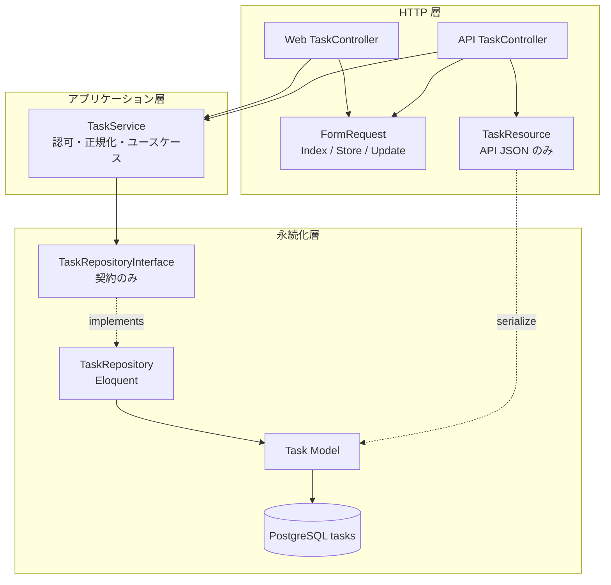
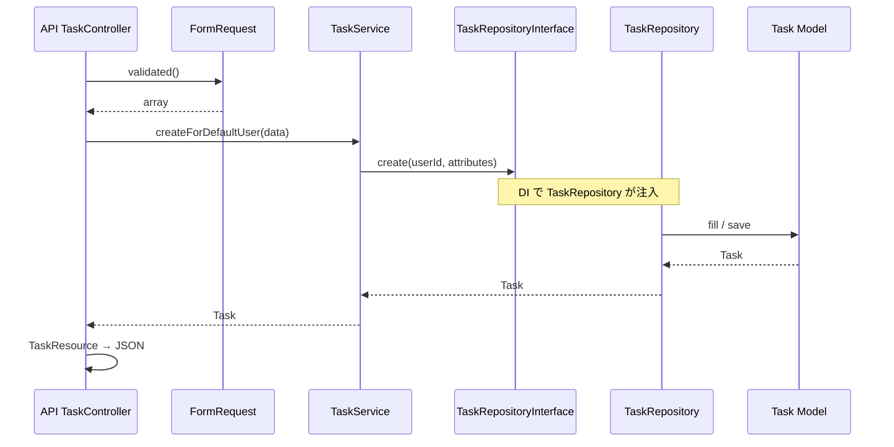

# 改良構成：技術更新に関する Laravel アプリ分析

本ドキュメントは、改良構成（Controller / Service / Repository + Interface）における **3 更新シナリオ** のレイヤ別影響分析です。実験手順は [experiment/scenarios/](./experiment/scenarios/)、比較結果は [experiment/results/COMPARISON.md](./experiment/results/COMPARISON.md) を参照してください。

## 目次

- [0. 前提アーキテクチャ（改良構成）](#0-前提アーキテクチャ改良構成)
- [1. API 仕様変更 — 属性追加（api-spec-change-priority）](#1-api-仕様変更--属性追加api-spec-change-priority)
- [2. API 仕様変更 — 既存属性の型変更（api-spec-change-status-int）](#2-api-仕様変更--既存属性の型変更api-spec-change-status-int)
- [3. DB / クエリ変更（db-schema-change）](#3-db--クエリ変更db-schema-change)
- [改良構成における「影響局所化」メカニズム](#改良構成における影響局所化メカニズム)
- [総合整理](#総合整理)
- [発表時の記載上の注意](#発表時の記載上の注意)

---

## **0. 前提アーキテクチャ（改良構成）**

> *研究対象: Laravel タスク管理アプリ（Web + REST API）  
> 目的: 技術更新時の影響を、レイヤ分離・DI・CI でどこまで局所化できるかを評価する*

---

### **0-1. 構成の要点（一覧）**

| **項目** | **内容** |
| --- | --- |
| レイヤ分離 | Controller / Service / Repository |
| 抽象化 | `TaskRepositoryInterface` による Repository の差し替え可能化 |
| 依存の向き | 一方向（上位 → 下位。下位は Interface のみ参照） |
| DI | `RepositoryServiceProvider` で Interface → 実装を bind |
| 入口の二系統 | Web（Blade）と API（JSON）が **同一 `TaskService`** を共有 |
| 評価スコープ | アプリ全体（認証・プロフィール含む）。タスク領域が改良の核 |
| CI/CD | GitHub Actions 4 ジョブ（PHPUnit / 品質 / Frontend / Newman） |

---

### **0-2. タスク領域のレイヤ構成（テキスト）**

```
HTTP (Web / API)
     ▼
TaskController (Web / API)   … HTTP の受け渡しのみ
     ▼
TaskService                  … 認可・入力正規化・ユースケース
     ▼
TaskRepositoryInterface      … 永続化の契約（メソッド定義のみ）
     ▼
TaskRepository               … Eloquent によるクエリ・CRUD
     ▼
Task (Model) → PostgreSQL
```

**横断する入出力（Controller 付近）**

- **FormRequest** … バリデーション（Web / API 共通）
- **TaskResource** … API レスポンス JSON の整形（API のみ）

---

### **0-3. 図（Mermaid）**

**0-3-1. レイヤ・依存関係（構造図）**



**0-3-2. API 作成の流れ（シーケンス例）**



---

### **0-4. クラスと責務**

| **レイヤ** | **クラス（パス）** | **責務** |
| --- | --- | --- |
| Web | `App\Http\Controllers\Web\TaskController` | ルート・View 返却・リダイレクト。`TaskService` へ委譲 |
| API | `App\Http\Controllers\API\TaskController` | JSON ステータス・`TaskResource`。`TaskService` へ委譲 |
| Service | `App\Services\TaskService` | `auth` によるユーザー特定、フィルタ/ペイロード正規化、404 変換 |
| Interface | `App\Repositories\Contracts\TaskRepositoryInterface` | `getFiltered` / `findById` / `create` / `update` / `delete` |
| Repository | `App\Repositories\TaskRepository` | Eloquent クエリ（検索・ソート・CRUD） |
| Model | `App\Models\Task` | テーブルマッピング・リレーション |
| バリデーション | `IndexTaskRequest`, `StoreTaskRequest`, `UpdateTaskRequest` | HTTP 入力ルール |
| API 表現 | `App\Http\Resources\TaskResource` | レスポンス JSON フィールド |
| DI | `App\Providers\RepositoryServiceProvider` | `TaskRepositoryInterface` → `TaskRepository` |

---

### **0-5. 依存関係のルール（一方向）**

```
Controller  →  TaskService  →  TaskRepositoryInterface
                                         ↑（実装は下位）
                               TaskRepository  →  Task Model
```

| **許可される依存** | **禁止・避ける依存** |
| --- | --- |
| Controller → Service, FormRequest, TaskResource | Controller → Eloquent / DB 直叩き |
| Service → Interface | Service → 具象 Repository クラス直参照 |
| Repository → Model | Repository → Controller / HTTP |

**DI の登録（`RepositoryServiceProvider`）**

```php
$this->app->bind(
    TaskRepositoryInterface::class,
    TaskRepository::class,
);
```

`TaskService` のコンストラクタは `TaskRepositoryInterface` のみを受け取る。

---

### **0-6. Web / API の共通化**

| **観点** | **内容** |
| --- | --- |
| 共有するもの | `TaskService`、FormRequest、Repository 一式 |
| Web 固有 | Blade（`tasks/index`, `create`, `edit`）、リダイレクト・フラッシュ |
| API 固有 | `TaskResource`、`JsonResponse`、HTTP ステータス（201 / 204 等） |
| ルート | Web: `routes/web.php` / API: `routes/api.php`（`apiResource`） |

**設計意図:** 仕様変更（属性追加・正規化）を **Service + Repository 周辺** に集約し、Web/API Controller の重複修正を避ける。

---

### **0-7. ディレクトリ（タスク関連）**

```
tech-update-task-app/
│
├── app/
│   ├── Http/
│   │   ├── Controllers/
│   │   │   ├── API/
│   │   │   │   └── TaskController.php
│   │   │   ├── Web/
│   │   │   │   └── TaskController.php
│   │   │   └── Concerns/
│   │   │       └── ParsesTaskRouteId.php
│   │   ├── Requests/
│   │   │   ├── IndexTaskRequest.php
│   │   │   ├── StoreTaskRequest.php
│   │   │   └── UpdateTaskRequest.php
│   │   └── Resources/
│   │       └── TaskResource.php
│   ├── Services/
│   │   └── TaskService.php
│   ├── Repositories/
│   │   ├── Contracts/
│   │   │   └── TaskRepositoryInterface.php
│   │   └── TaskRepository.php
│   ├── Models/
│   │   └── Task.php
│   └── Providers/
│       └── RepositoryServiceProvider.php
│
├── routes/
│   ├── web.php          ← Web TaskController
│   └── api.php          ← API TaskController
│
└── resources/
    ├── views/tasks/
    │   ├── index.blade.php
    │   ├── create.blade.php
    │   ├── edit.blade.php
    │   └── _form.blade.php
    └── js/
        └── app.js       ← Alpine（薄いフロント）
```

---

### **0-8. 研究上のスコープ（タスク外も含む）**

| **領域** | **アーキテクチャ** | **備考** |
| --- | --- | --- |
| **タスク** | 改良構成（本ドキュメント） | 更新シナリオ比較の **主対象** |
| **認証・プロフィール** | Laravel Breeze 標準 | Controller → User Model 直操作 |
| **フロント** | Blade + Tailwind + Vite + Alpine | JS は薄いが CI の build に連動 |
| **品質・CI** | PHPUnit, PHPStan, ESLint, Newman | 4 ジョブで変更種別ごとに検知 |

> *本分析の 3 シナリオはタスク領域に焦点を当てる。フレームワーク横断更新は評価スコープ外とする。*

---

### **0-9. 技術スタック（前提）**

| **区分** | **技術** |
| --- | --- |
| バックエンド | Laravel 13、PHP 8.4 |
| 認証 | Laravel Breeze（セッション） |
| DB | PostgreSQL |
| フロント | Blade、Tailwind CSS、Vite、Alpine.js |
| 静的解析・整形 | PHPStan (Larastan)、Laravel Pint、ESLint |
| テスト | PHPUnit、Postman / Newman |
| CI | GitHub Actions: PHP Tests / PHP Quality / Frontend / API Tests |

---

### **0-10. ベースライン仕様（タスク属性）**

| **属性** | **説明** |
| --- | --- |
| `title` | 必須、一覧で部分一致検索可 |
| `description` | 任意 |
| `status` | `todo` / `in_progress` / `done` |
| `due_date` | 任意、一覧でソート可 |

API 一覧クエリ例: `?title=...&status=...&due_date_sort=asc|desc`

---

### **0-11. 更新シナリオとの対応**

| **シナリオ ID** | **内容** | **主に触れるレイヤ（改良構成）** |
| --- | --- | --- |
| `api-spec-change-priority` | 新属性 `priority` 追加 | Resource, Request×2, Service, Model, migration, テスト（+ 任意 Web） |
| `api-spec-change-status-int` | 既存 `status` を string → int へ型変更 | Resource, Request×3, Service, Model, migration（データ移行）, config, テスト, Web View（+ Repository フィルタ） |
| `db-schema-change` | タイトル検索を case-insensitive に | **Repository のみ**（+ テスト） |

### **0-12. 関連リポジトリ情報**

| **項目** | **内容** |
| --- | --- |
| リポジトリ役割 | 改良構成（良い例）の実験台 |
| 比較対象 | 従来構成 / `legacy-architecture` ブランチ |
| ベースラインタグ | `experiment-baseline-v1`（4 属性） |
| 詳細設計 | [EXPERIMENT.md](./EXPERIMENT.md)、[experiment/scenarios/](./experiment/scenarios/) |
| 実測済み結果 | `api-spec-change-priority` → [COMPARISON.md](./experiment/results/COMPARISON.md)；`db-schema-change` → logs のみ（`run-20260523T012455Z` improved / `run-20260523T012713Z` legacy） |

---

## **1. API 仕様変更 — 属性追加（`api-spec-change-priority`）**

（実験例: `priority` 追加 — [api-spec-change-priority.md](./experiment/scenarios/api-spec-change-priority.md)、実測 `run-20260521T060318Z`）

### **■ 更新内容**

- REST レスポンス形状（`TaskResource` に `priority`）
- リクエストバリデーション（`StoreTaskRequest` / `UpdateTaskRequest`）
- 永続化（マイグレーション、`Task` の fillable）
- ドメイン入力の正規化（`TaskService::normalizeTaskPayload` の許可リスト）
- 契約テスト（`TaskApiTest`、Newman/Postman）
- Web parity 時は Blade フォーム（`tasks/_form.blade.php`）

### **■ 変更したくない箇所**

- **`API\TaskController` / `Web\TaskController`**（薄い委譲のまま）
- **`TaskRepositoryInterface` のメソッドシグネチャ**
- **`TaskRepository` のクエリロジック**
- **ルーティング**

### **■ 変更を許容する箇所**

- `TaskResource`、`FormRequest`×2、`TaskService`、マイグレーション、`Task` Model
- テスト・Postman、必要なら Web View

### **■ 影響範囲**

| **レイヤ** | **ファイル例** |
| --- | --- |
| API 表現 | `app/Http/Resources/TaskResource.php` |
| HTTP 入力検証 | `StoreTaskRequest.php`, `UpdateTaskRequest.php` |
| ユースケース | `app/Services/TaskService.php` |
| 永続化 | `database/migrations/*`, `app/Models/Task.php` |
| テスト・CI | `tests/Feature/TaskApiTest.php`, Postman コレクション |
| （任意）Web | `resources/views/tasks/_form.blade.php`, `TaskWebTest.php` |

**触れない:** Controller、Repository、Interface

### **■ 想定修正箇所**

Controller（×）→ **Resource / Request / Service / Model / migration / テスト / View**

### **■ 修正ファイル数**

**中**（約 7〜10 ファイル）

### **■ 修正行数**

**中**（数十〜百行程度）

### **■ 変更レイヤ数**

**4〜5**

### **■ 更新耐性の評価**

**中**

### **■ 理由**

- 仕様変更は **HTTP 境界とドメイン正規化に必然的に波及**する。
- 改良構成では **正規化が `TaskService` に 1 か所**あり、従来構成の Controller 重複は避けられる。
- **Resource・Request・DB・テストは避けられない**。
- **実測（improved / legacy 共通）:** `after_update` PHPUnit 36/38、Newman 10/13。**主指標は `after_fix` の `files_changed`**（従来は Controller +2）。

---

## **2. API 仕様変更 — 既存属性の型変更（`api-spec-change-status-int`）**

（想定実験: `status` を string → int へ変更 — [api-spec-change-status-int.md](./experiment/scenarios/api-spec-change-status-int.md)）

### **■ 更新内容**

- REST レスポンス: `TaskResource` の `status` を **整数**で返却
- リクエストバリデーション: `StoreTaskRequest` / `UpdateTaskRequest` / **`IndexTaskRequest`**
- 永続化: マイグレーション + **既存データの移行**
- ドメイン正規化: `TaskService::normalizeTaskPayload` / **`normalizeListFilters`**
- 設定: `config/task.php`
- Model: PHPDoc・casts
- Repository: `getFiltered` 内 status フィルタの int 比較
- Web: `_form.blade.php` / `index.blade.php`
- テスト・Postman: 全 status アサーションの書き換え

### **■ 変更したくない箇所**

- **`API\TaskController` / `Web\TaskController`**
- **`TaskRepositoryInterface` のメソッドシグネチャ**
- **ルーティング**

### **■ 変更を許容する箇所**

- `TaskResource`、`FormRequest`×3、`TaskService`、`config/task.php`、migration、`Task` Model
- **`TaskRepository::getFiltered`**（status フィルタのみ）
- テスト・Postman・Web View 一式

### **■ 影響範囲**

| **レイヤ** | **ファイル例** | **priority 追加との差分** |
| --- | --- | --- |
| API 表現 | `TaskResource.php` | 既存フィールドの **型変更**（破壊的） |
| HTTP 入力検証 | `Store/Update/IndexTaskRequest.php` | **Index も対象** |
| ユースケース | `TaskService.php` | payload **と** list filter |
| 設定 | `config/task.php` | 必須 |
| 永続化 | migration + `Task.php` | **データ移行**が追加 |
| Repository | `TaskRepository.php` | priority では不変、本シナリオでは **追随** |
| Web | `_form.blade.php`, `index.blade.php` | 表示ロジック変更幅大 |
| テスト・CI | 全 Task 関連 Feature テスト, Newman | **全面書き換え** |

**触れない:** Controller、Interface のシグネチャ

### **■ 想定修正箇所**

Controller（×）→ **Resource / Request×3 / Service / config / Model / migration / Repository（フィルタのみ）/ テスト / View**

### **■ 修正ファイル数**

**中〜多**（約 10〜14 ファイル）

### **■ 修正行数**

**中〜多**（百行超の可能性）

### **■ 変更レイヤ数**

**5〜6**

### **■ 更新耐性の評価**

**低〜中**

### **■ 理由**

- **破壊的変更**のため HTTP・DB・テスト・Web の横断修正が不可避。
- Service 集約は維持するが、Repository フィルタ・config まで波及し priority より局所化効果が小さい。
- **未実施** — `exp/api-spec-change-status-int` で計測推奨。

---

## **3. DB / クエリ変更（`db-schema-change`）**

（実験例: タイトル部分一致を case-insensitive に — [db-schema-change.md](./experiment/scenarios/db-schema-change.md)）

### **■ 更新内容**

- 一覧フィルタの SQL 実装のみ（`TaskRepository::getFiltered` 内）:

```php
$title = $filters['title'] ?? null;
if (is_string($title) && $title !== '') {
    $query->where('title', 'like', '%'.$this->escapeLike($title).'%');
}
```

→ `whereRaw('LOWER(title) LIKE ?', ...)` 等へ変更

- `TaskListFilterTest` へ case-insensitive テスト 2 件追加（Web / API）

### **■ 変更したくない箇所**

- **Controller（Web/API）**
- **`TaskService`**
- **`TaskRepositoryInterface`**
- **View / JS / API JSON 形状**

### **■ 変更を許容する箇所**

- `TaskRepository.php`
- `tests/Feature/TaskListFilterTest.php`

### **■ 影響範囲**

| **レイヤ** | **影響** |
| --- | --- |
| Repository | **主修正**（1 メソッド内 1〜2 行） |
| Service / Controller / Resource | なし |
| テスト | Feature テスト追加 |

### **■ 想定修正箇所**

**Repository のみ**（本番）+ **テスト**

### **■ 修正ファイル数**

**少**（本番 1 + テスト 1 = 2。従来構成は **+1 Controller**）

### **■ 修正行数**

**少**（Repository 1〜3 行 + テスト 20〜40 行）

### **■ 変更レイヤ数**

**2**

### **■ 更新耐性の評価**

**高**

### **■ 理由**

- 検索仕様の変更が **Eloquent クエリ構築箇所に閉じる**。
- Web/API が同一 Repository 経由のため **重複修正なし**。
- **実測ログ:** improved 15 分、legacy 20 分。`git.files_changed` は発表前に計測推奨。

---

## **改良構成における「影響局所化」メカニズム**

### **Repository パターン**

- **`db-schema-change`:** `getFiltered` 内 1 行変更で Web/API 両方が直る。
- **`api-spec-change-priority`:** Interface 不変のため Repository **未変更**。
- **`api-spec-change-status-int`:** status フィルタのみ追随。

### **Interface による抽象化**

- クエリ差し替え（シナリオ 3）時、Service の再テスト範囲を Repository に縮小。
- API 仕様変更（シナリオ 1・2）では HTTP 境界が主戦場。

### **Service 層**

- **`api-spec-change-priority`:** 許可リスト拡張が **Service 1 か所**（実測済み）。
- **`api-spec-change-status-int`:** payload と list filter を Service で集約。

### **CI/CD（GitHub Actions 4 ジョブ）**

- 3 シナリオ共通: `after_update` で失敗数を記録、`after_fix` で CI 緑。
- **通過率だけでは improved/legacy の差が出ない**場合がある。**`files_changed` が主指標**。

---

## **総合整理**

### **改良構成で最も変更に強いシナリオ**

| **順位** | **シナリオ** | **根拠** |
| --- | --- | --- |
| 1 | **`db-schema-change`** | 本番 **1 ファイル・1 レイヤ**、変更レイヤ数 **2** |
| 2 | **`api-spec-change-priority`** | Controller / Repository **不変**、正規化 Service 1 か所 |
| 3 | **`api-spec-change-status-int`** | 破壊的型変更で **5〜6 レイヤ** |

### **3 シナリオ比較一覧（改良構成）**

| **シナリオ** | **主な修正ファイル** | **ファイル数** | **行数** | **変更レイヤ数** | **更新耐性** | **Controller** | **Repository** |
| --- | --- | --- | --- | --- | --- | --- | --- |
| `api-spec-change-priority` | Resource, Request×2, Service, migration, Model, tests | 中（7〜10） | 中 | 4〜5 | **中** | **不変** | **不変** |
| `api-spec-change-status-int` | 上記 + IndexRequest, config, Repository, View | 中〜多（10〜14） | 中〜多 | 5〜6 | **低〜中** | **不変** | **フィルタのみ** |
| `db-schema-change` | **Repository**, TaskListFilterTest | **少（2）** | **少** | **2** | **高** | **不変** | **主修正** |

### **2 種 API 仕様変更の対比**

| **観点** | **priority 追加** | **status → int** |
| --- | --- | --- |
| 変更種別 | 非破壊的（属性追加） | 破壊的（既存フィールド型変更） |
| Repository | 触らない | status フィルタ追随 |
| FormRequest | Store / Update | Store / Update / **Index** |
| データ移行 | default 値で可 | **既存行の変換必須** |
| 改良構成の優位 | Controller 重複回避（vs legacy +2） | 同左だが **修正総量が大きく差が縮小** |
| 実測 | improved/legacy 通過率同一 | 未実施 |

---

## **発表時の記載上の注意**

1. **通過率だけでは構成差が出ない**（`api-spec-change-priority` は improved/legacy で `after_update` が同一）。主指標は **`after_fix` の `files_changed` / `lines_*`**。
2. **API 仕様変更 2 種を分けて報告**する（priority と status-int）。
3. **`db-schema-change` は results 未掲載**。発表前に `git.files_changed` を計測し legacy 比 **+1 Controller** を数値化する。
4. **「修正範囲」と「CI で赤になる範囲」** を分ける。
